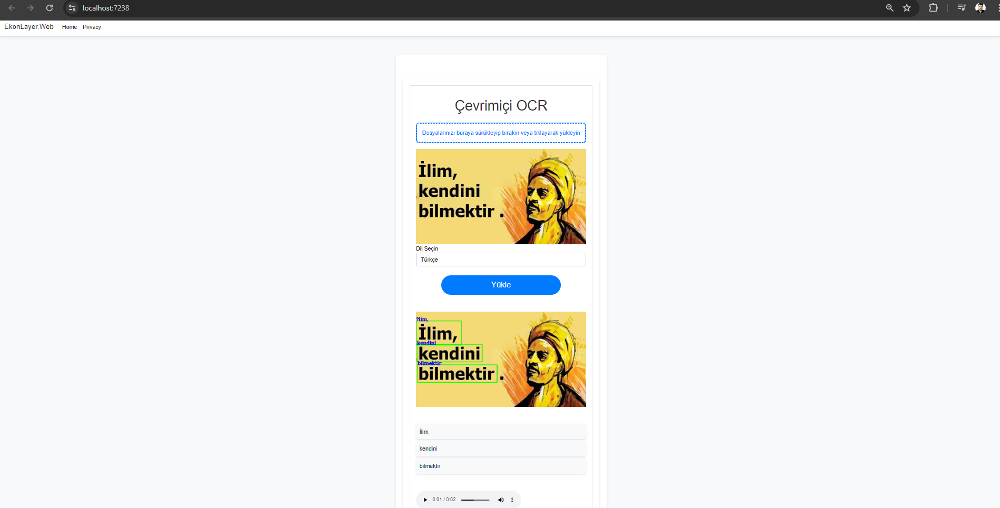

# Çevrimiçi OCR Sistemi
## Proje Açıklaması
Bu proje, bir web arayüzü üzerinden kullanıcıların görüntü dosyalarını yükleyerek optik karakter tanıma (OCR) işlemi yapmalarını sağlar. Yüklenen görüntüdeki metinler tanınarak kullanıcıya metin ve ses dosyası olarak geri döndürülür. Sistem, bir ASP.NET Core MVC uygulaması ve bir Flask tabanlı OCR servisi içerir.

## Kullanılan Teknolojiler
- Frontend: HTML, CSS, JavaScript, Bootstrap
- Backend: ASP.NET Core MVC, Flask
- OCR: EasyOCR
- Diğer: Google Text-to-Speech (gTTS), PDF to Image conversion (pdf2image)
## Proje Kurulumu
### Gereksinimler
- .NET 6 SDK
- Python 3.x
- Node.js ve npm (JavaScript bağımlılıkları için)
  
Flask deposunu klonlayın:
 ```bash
git clone https://github.com/muharremosmantopakkaya/Flask_OCR.git
cd Flask_OCR
 ```
Gerekli Python paketlerini yükleyin.
 ```bash
pip install -r requirements.txt
 ```
Flask uygulamasını çalıştırın.
 ```bash
python app.py
 ```
Flask OCR hizmeti artık http://localhost:5000 adresinde çalışıyor olmalı.

### NET Core Uygulamasını Kurma
.NET Core uygulamasının GitHub deposu adresinden kodları indirin veya klonlayın.
 ```bash
git clone https://github.com/muharremosmantopakkaya/Online-OCR-System.git
cd Online-OCR-System
 ```
Gerekli bağımlılıkları yükleyin.
 ```bash
dotnet restore
 ```
Uygulamayı çalıştırın.
 ```bash
dotnet run
 ```
## Kullanım
- Web tarayıcınızı açın ve http://localhost:5000 adresine gidin.
- Dosyanızı yükleyin ve OCR işlemi için dili seçin.
- "Yükle" butonuna tıklayın.
- Sonuçlar, algılanan metin ve ses dosyası olarak görüntülenecektir.

<div style="display:flex; justify-content: space-between;"> 
  
</div>
[![Detaylı Çalışma Prensibi]]([https://www.youtube.com/shorts/o9t2ZGJpBAs](https://www.youtube.com/watch?v=1LyBzkIwo-g&ab_channel=MuharremTopakkaya))
